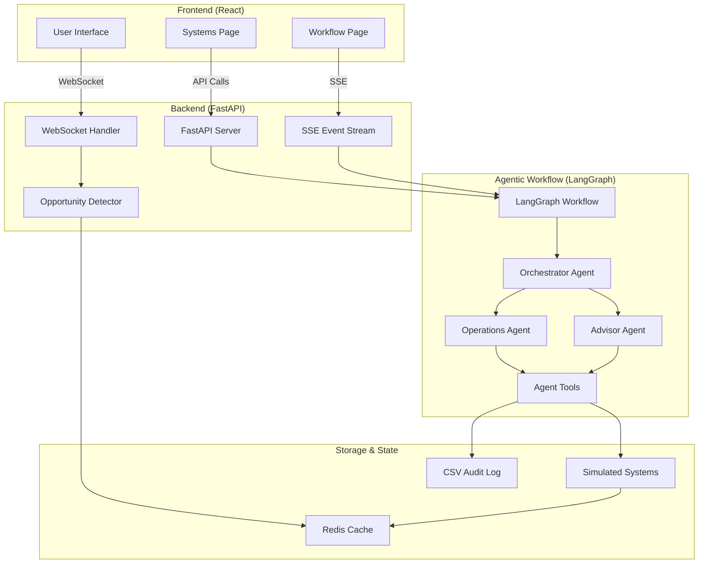

# Nexhelm - AI-Powered Financial Advisory Platform

A comprehensive AI-powered financial advisory platform combining real-time opportunity detection with intelligent agentic workflow automation. Built with FastAPI, React, LangGraph, WebSockets, and Redis for seamless real-time communication, intelligent workflow execution, and automated financial operations.

---

## Table of Contents

- [Core Systems](#core-systems)
- [Features](#features)
- [Architecture](#architecture)
- [Quick Start](#quick-start)
- [Using the Agentic Workflow System](#using-the-agentic-workflow-system)
- [Backend Systems Dashboard](#backend-systems-dashboard)
- [Demo Mode](#demo-mode)
- [API Endpoints](#api-endpoints)
- [Opportunity Detection Engine](#opportunity-detection-engine)
- [Tech Stack](#tech-stack)
- [Contributing](#contributing)
- [License](#license)

---

## Core Systems

### 1. **Real-Time Opportunity Detection**
AI-powered system that identifies financial opportunities from live meeting transcripts in real-time.

### 2. **Agentic Workflow System** (NEW)
Autonomous multi-agent system for executing complex financial workflows using LangGraph.

### 3. **Backend Systems Dashboard** (NEW)
Live monitoring of simulated CRM and account systems with real-time updates.

---

## Key Features at a Glance

| Feature | Description | Technology |
|---------|-------------|------------|
| **Multi-Agent System** | 3 specialized AI agents (Orchestrator, Operations, Advisor) | LangGraph + GPT-4 |
| **Real-Time Streaming** | Watch agents think and execute in real-time | Server-Sent Events (SSE) |
| **Compliance Guardrails** | Financial regulation enforcement built-in | Custom validation logic |
| **Live Dashboards** | Monitor CRM and account systems as they update | React + Auto-refresh |
| **Audit Logging** | CSV transaction logs for compliance | CSV export |
| **Opportunity Detection** | AI-powered financial opportunity identification | GPT-4 + Pattern matching |
| **Task Management** | Intelligent task creation and routing | LangGraph state machine |
| **WebSocket Communication** | Bidirectional real-time messaging | FastAPI WebSockets |
| **Modern UI/UX** | Beautiful, responsive interface | React + Tailwind CSS |
| **Demo Mode** | 3 realistic conversation scenarios | Simulated transcripts |

---

## Features

### **Intelligent Opportunity Detection**
- **AI-Powered Analysis**: Uses GPT-4 for sophisticated financial opportunity detection
- **Real-Time Processing**: Analyzes conversation context as it happens
- **Multiple Opportunity Types**: Retirement planning, education savings, life insurance, estate planning
- **Priority Scoring**: High/Medium/Low priority classification with numerical scores
- **Context-Aware**: Considers client profile, age, income, and conversation history

### **Agentic Workflow System**
- **Multi-Agent Architecture**: Orchestrator, Operations, and Advisor agents working together
- **LangGraph Framework**: State-based workflow execution with intelligent routing
- **Real-Time Streaming**: Live updates of agent communication and task execution
- **Autonomous Task Planning**: Agents intelligently create and execute workflows
- **Domain-Specific Guardrails**: Financial compliance and safety checks built-in
- **CSV Audit Logging**: Complete transaction history for compliance
- **Interactive UI**: Watch agents think, communicate, and execute tasks in real-time

### **Backend Systems Dashboard**
- **CRM Monitoring**: Live view of client information and existing accounts
- **Account System Tracking**: Real-time account creation and status updates
- **Auto-Refresh**: Dashboards update as workflows execute
- **Simulated Systems**: Realistic backend systems for demonstrations

### **Interactive Demo System**
- **3 Realistic Scenarios**: Retirement Planning, Education Planning, Life Changes
- **1-2 Minute Conversations**: Natural timing with realistic pauses
- **Automatic Opportunity Detection**: Opportunities appear in real-time during demo
- **Professional Demo Experience**: Perfect for presentations and client meetings

###  **Real-Time Communication**
- **WebSocket Integration**: Instant message delivery and opportunity notifications
- **Server-Sent Events (SSE)**: Real-time workflow event streaming
- **Live Transcript**: Real-time conversation display with speaker identification
- **Toast Notifications**: High-priority opportunity alerts
- **Connection Management**: Automatic reconnection and status indicators

###  **Modern UI/UX**
- **Beautiful Design**: Gradient backgrounds, smooth animations, and professional styling
- **Responsive Layout**: Works perfectly on desktop and mobile devices
- **Interactive Elements**: Hover effects, loading states, and visual feedback
- **Accessibility**: Clear typography, color contrast, and intuitive navigation
- **Thinking Indicators**: Visual feedback showing when agents are processing

## Architecture

### **Backend (FastAPI + Python + LangGraph)**
```
backend/
├── app/
│   ├── main.py                      # FastAPI server with WebSocket & SSE endpoints
│   ├── opportunity_detector.py      # AI-powered opportunity detection engine
│   ├── dummy_transcript.py          # Demo conversation scenarios
│   ├── redis_client.py              # Redis state management
│   └── workflow/                    # Agentic Workflow System
│       ├── graph.py                 # LangGraph workflow graph definition
│       ├── state.py                 # Workflow state management
│       ├── routing.py               # Intelligent agent routing logic
│       ├── storage.py               # Simulated backend systems (CRM, Accounts)
│       ├── agents/                  # Multi-agent system
│       │   ├── orchestrator_agent.py   # Workflow planning & task creation
│       │   ├── operations_agent.py     # Backend operations & compliance
│       │   └── advisor_agent.py        # Client communication & notifications
│       ├── nodes/                   # LangGraph node implementations
│       │   ├── orchestrator.py      # Orchestrator node
│       │   ├── operations.py        # Operations node
│       │   ├── advisor.py           # Advisor node
│       │   └── supervisor.py        # Supervisor routing node
│       └── tools/                   # Agent tool implementations
│           └── agent_tools.py       # All agent tools (CRM, accounts, etc.)
├── requirements.txt                 # Python dependencies
├── account_logs.csv                 # Transaction audit log
└── test_*.py                        # Test files
```

### **Frontend (React + TypeScript)**
```
frontend/
├── src/
│   ├── App.tsx                      # Main application with routing
│   ├── pages/                       # Page components
│   │   ├── WorkflowPage.tsx         # Agentic workflow interface
│   │   └── SystemsPage.tsx          # Backend systems dashboard
│   ├── index.tsx                    # Application entry point
│   └── index.css                    # Global styles with Tailwind
├── package.json                     # Node.js dependencies
└── tailwind.config.js               # Tailwind CSS configuration
```

### **System Architecture Diagram**



### **Data Flow**

#### **Opportunity Detection Flow**
1. **WebSocket Connection**: Real-time bidirectional communication
2. **Message Processing**: Store in Redis, analyze with AI
3. **Opportunity Detection**: Context-aware financial opportunity identification
4. **Real-Time Updates**: Instant UI updates and notifications

#### **Agentic Workflow Flow**
1. **Request Submission**: User initiates workflow (e.g., "Open Roth IRA")
2. **Orchestrator Planning**: Creates task list and assigns to agents
3. **Agent Execution**: Operations and Advisor agents execute tasks sequentially
4. **Real-Time Streaming**: SSE updates UI with agent activities
5. **System Updates**: CRM and account systems updated in real-time
6. **Audit Logging**: All operations logged to CSV for compliance

## Quick Start

### **Prerequisites**
- Python 3.11+ with conda
- Node.js 16+
- Redis server
- OpenAI API key (GPT-4 recommended for best results)

### **1. Environment Setup**
```bash
# Create and activate conda environment
conda create -n nexhelm python=3.11
conda activate nexhelm

# Install Python dependencies (includes LangGraph, LangChain)
cd backend
pip install -r requirements.txt

# Install Node.js dependencies
cd ../frontend
npm install
```

### **2. Environment Variables**
Create a `.env` file in the backend directory:
```env
OPENAI_API_KEY=your_openai_api_key_here
OPENAI_MODEL=gpt-4  # or gpt-3.5-turbo
REDIS_HOST=localhost
REDIS_PORT=6379
REDIS_DB=0
```

### **3. Start the Application**

**Terminal 1 - Redis Server:**
```bash
redis-server
```

**Terminal 2 - Backend Server:**
```bash
conda activate nexhelm
cd backend
python -m uvicorn app.main:app --host 0.0.0.0 --port 8002 --reload
```

**Terminal 3 - Frontend Server:**
```bash
cd frontend
npm start
```

### **4. Access the Application**
- **Main App**: http://localhost:3000
  - Opportunity Detection (default page)
  - Agentic Workflow (navigate via header)
  - Backend Systems Dashboard (navigate via header)
- **Backend API**: http://localhost:8002
- **API Documentation**: http://localhost:8002/docs
- **Test Interface**: http://localhost:8002/test

---

## Using the Agentic Workflow System

### **What It Does**
Automates complex financial workflows like opening IRAs, account transfers, or compliance checks using autonomous AI agents that plan, execute, and coordinate tasks.

### **How to Use**

1. **Navigate to Workflow Page**
   - Click "Agentic Workflow" in the header
   
2. **Start a Workflow**
   - Enter client ID (e.g., `test_client_complete`)
   - Enter request description (e.g., `Open a Roth IRA account`)
   - Click "Start Workflow"

3. **Watch Agents Work**
   - **Events Tab**: See agent communication in real-time
   - **Tasks Tab**: Monitor task progress and completion
   - **Progress Bar**: Track overall workflow completion

4. **Review Results**
   - Download CSV log for audit trail
   - Check Backend Systems Dashboard for updates

### **Agent Roles**

| Agent | Role | Responsibilities |
|-------|------|------------------|
| **Orchestrator** | Workflow Planner | Creates task list, assigns to agents, manages dependencies |
| **Operations** | Backend Executor | Eligibility checks, document validation, account creation |
| **Advisor** | Client Communication | Document requests, notifications, client updates |

### **Example Workflows**

#### **Open Roth IRA**
```
Client ID: test_client_complete
Request: Open a Roth IRA account
Expected Flow:
1. Orchestrator creates 5 tasks
2. Operations checks eligibility
3. Advisor collects documents
4. Operations validates documents
5. Operations creates account
6. Advisor notifies client
```

#### **Account Transfer**
```
Client ID: test_client_transfer
Request: Transfer 401k to IRA
Expected Flow:
1. Orchestrator creates transfer workflow
2. Operations verifies eligibility
3. Advisor requests transfer forms
4. Operations processes transfer
5. Advisor confirms completion
```

---

## Backend Systems Dashboard

### **What It Shows**
Real-time view of simulated backend systems (CRM and Account System) to demonstrate how agents interact with enterprise systems.

### **How to Use**

1. **Navigate to Systems Page**
   - Click "Backend Systems" in the header
   
2. **View CRM Data**
   - Client information
   - Existing accounts per client
   - Auto-refreshes every 5 seconds

3. **View Account System**
   - All created accounts
   - Account types and statuses
   - Balance information

4. **Watch Updates**
   - Run a workflow from Workflow Page
   - Watch Systems Dashboard update in real-time
   - See new accounts appear automatically

### **System Components**

| System | Purpose | Data Stored |
|--------|---------|-------------|
| **CRM** | Client relationship management | Client profiles, contact info, account references |
| **Account System** | Account management | Account details, balances, types, status |
| **CSV Log** | Audit trail | All account creation transactions |

---

## Demo Mode

### **Available Scenarios**

#### **1. Retirement Planning (90 seconds)**
- Topics: 401k optimization, Roth conversions, healthcare planning
- Opportunities: Retirement income planning, catch-up contributions, long-term care

#### **2. Education Planning (75 seconds)**
- Topics: 529 plans, college savings, Northwestern University
- Opportunities: Education savings strategies, financial aid optimization

#### **3. Life Changes & Planning (80 seconds)**
- Topics: New baby, promotion, house buying, life insurance
- Opportunities: Life insurance needs, estate planning, financial protection

### **How to Use Demo Mode**
1. **Start a Meeting**: Click "Start New Meeting"
2. **Select Scenario**: Choose from dropdown (Retirement, Education, Life Changes)
3. **Start Demo**: Click "Start Demo"
4. **Watch Magic**: Opportunities appear automatically in real-time
5. **Stop Anytime**: Click "Stop Demo" to end early

## API Endpoints

### **Meeting Management**
- `POST /api/meeting/create` - Create new meeting session
- `GET /api/meeting/{meeting_id}/history` - Get conversation history
- `WebSocket /ws/{meeting_id}` - Real-time communication

### **Demo System**
- `GET /api/demo/scenarios` - Get available demo scenarios
- `POST /api/demo/start/{meeting_id}` - Start demo conversation
- `POST /api/demo/stop/{meeting_id}` - Stop demo conversation
- `GET /api/demo/status/{meeting_id}` - Check demo status

### **Agentic Workflow**
- `POST /api/workflow/start` - Start agentic workflow execution
- `GET /api/workflow/events` - Server-Sent Events stream for real-time updates
- `GET /api/workflow/download-log` - Download CSV audit log

### **Backend Systems**
- `GET /api/systems/crm` - Get all CRM client data
- `GET /api/systems/accounts` - Get all account system data
- `POST /api/systems/reset` - Reset simulated systems (for testing)

## Opportunity Detection Engine

### **Detection Methods**
1. **Pattern Matching**: Keyword-based detection for common financial topics
2. **AI Analysis**: GPT-3.5-turbo for sophisticated context understanding
3. **Client Profile**: Age, income, and family status consideration
4. **Conversation Context**: Recent message analysis for relevance

### **Opportunity Types**
- **Retirement Planning**: 401k, IRA, Roth conversions, catch-up contributions
- **Education Savings**: 529 plans, college funding, financial aid
- **Life Insurance**: Term life, whole life, disability insurance
- **Estate Planning**: Wills, trusts, beneficiary planning
- **Investment Planning**: Portfolio diversification, risk management

### **Scoring System**
- **High Priority (85-100)**: Immediate action recommended
- **Medium Priority (70-84)**: Important but not urgent
- **Low Priority (50-69)**: Good to consider for future

## UI Components

### **Main Interface**
- **Header**: Connection status, client profile, meeting controls
- **Transcript Panel**: Real-time conversation with speaker identification
- **Opportunities Panel**: Live opportunity detection with priority scoring
- **Demo Controls**: Scenario selection and demo management
- **Input Area**: Message composition with voice simulation

### **Visual Elements**
- **Gradient Backgrounds**: Professional blue and amber color schemes
- **Smooth Animations**: Framer Motion for polished interactions
- **Toast Notifications**: Real-time feedback and alerts
- **Status Indicators**: Connection status, demo mode, processing states

## Security & Best Practices

### **Data Handling**
- **Redis Storage**: Temporary conversation storage with TTL
- **API Key Management**: Secure environment variable handling
- **CORS Configuration**: Proper cross-origin resource sharing
- **Input Validation**: Sanitized user inputs and message handling

### **Performance**
- **Connection Pooling**: Efficient Redis connection management
- **Message Batching**: Optimized WebSocket message delivery
- **Caching Strategy**: Redis-based conversation and opportunity caching
- **Error Handling**: Graceful degradation and user feedback

## Testing

### **Backend Testing**
```bash
cd backend
python -m pytest test_*.py
```

### **Frontend Testing**
```bash
cd frontend
npm test
```

### **Integration Testing**
- WebSocket connection testing
- Opportunity detection validation
- Demo scenario verification
- API endpoint testing

## Monitoring & Logging

### **Backend Logs**
- Connection status and WebSocket events
- Opportunity detection results
- Redis operations and errors
- API request/response logging

### **Frontend Logs**
- WebSocket connection status
- Demo mode state changes
- User interaction tracking
- Error boundary handling

## Deployment

### **Production Considerations**
- **Environment Variables**: Secure API key management
- **Redis Configuration**: Production Redis setup
- **WebSocket Scaling**: Load balancer WebSocket support
- **SSL/TLS**: HTTPS for secure communication
- **Monitoring**: Application performance monitoring


### **System Documentation**

6. **[SYSTEM_ARCHITECTURE.md](SYSTEM_ARCHITECTURE.md)**
   - High-level system overview
   - Component relationships
   - Technology choices

7. **Workflow-Specific READMEs**
   - `backend/workflow/README.md` - LangGraph implementation details


---

## Tech Stack

### **Backend**
- **FastAPI**: High-performance Python web framework
- **LangGraph**: State machine orchestration for agents
- **LangChain**: LLM integration and agent tooling
- **OpenAI GPT-4**: Large language model for intelligent decision-making
- **Redis**: In-memory data store for state management
- **Pydantic**: Data validation and settings management

### **Frontend**
- **React 18**: Modern UI library with hooks
- **TypeScript**: Type-safe JavaScript
- **Tailwind CSS**: Utility-first CSS framework
- **Lucide React**: Beautiful icon library
- **Server-Sent Events (SSE)**: Real-time streaming from server


---

## License

This project is licensed under the MIT License - see the LICENSE file for details.

---

## Acknowledgments

- **OpenAI**: For providing the GPT-4 API and advancing AI capabilities
- **LangChain & LangGraph**: For excellent agent orchestration frameworks
- **FastAPI**: For the performant Python web framework
- **React**: For the powerful frontend library
- **Redis**: For reliable data storage and caching
- **Tailwind CSS**: For beautiful, utility-first styling


